# 模型结构说明（日 / 自然周 / 自然月）

本文档用图文说明三套 **尺度对齐、彼此独立** 的涨跌二分类模型：各自的数据入口、张量输入、网络拓扑与输出语义。

| 项 | 值 |
|----|-----|
| 代码 | `backend/app/ml/`（网络类：[`lstm_model.py`](../backend/app/ml/lstm_model.py)） |
| 特征版本 | `v5-scale` |
| 任务 | 二分类：下一根同尺度 K 相对本根是否上涨 |
| 共性骨架 | `StockLSTM`：多层 LSTM（时间展开）→ 取末步隐状态 → Dropout → Linear(1) → logit → 涨/跌 |

> 旧版 `v4-clf`（日频三头）已废弃，需按本版重新训练。

**读图约定（全文统一）：**

| 轴 | 方向 | 含义 |
|----|------|------|
| **时间轴** | 左 → 右 | 从历史 bar 流向最新 bar（序列长度 = lookback） |
| **层级轴** | 底 → 顶 | 从原始特征流向更高层抽象，再到涨跌分类头 |

---

## 0. 总览：三套模型互不共享权重

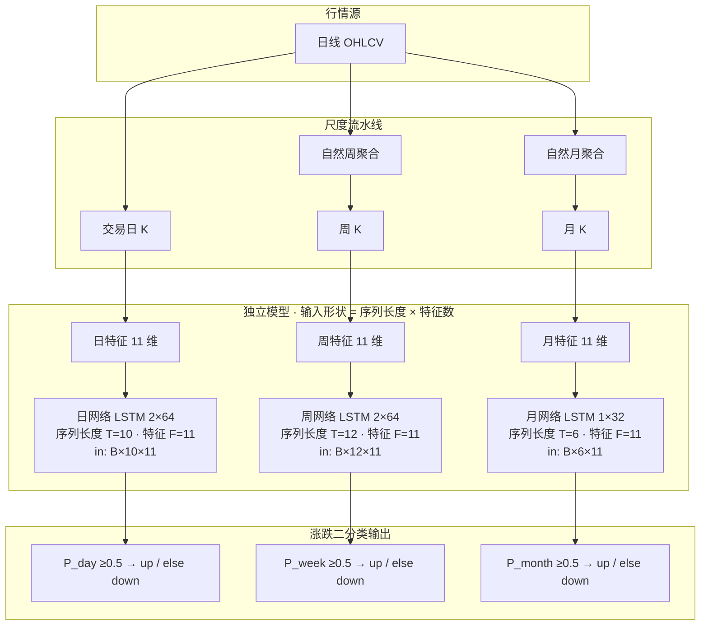

| 尺度 | 输入 bar | 序列长度 T | 特征数 F | 输入张量 | 网络 | 涨跌含义 |
|------|----------|------------|----------|----------|------|----------|
| **日** | 交易日 | **10** | **11** | `(B, 10, 11)` | LSTM×2, h=64, dropout=0.3 | 下一 **交易日** 涨/跌 |
| **周** | 自然周 | **12** | **11** | `(B, 12, 11)` | LSTM×2, h=64, dropout=0.3 | 下一 **自然周** 涨/跌 |
| **月** | 自然月 | **6** | **11** | `(B, 6, 11)` | LSTM×1, h=32, dropout=0.4 | 下一 **自然月** 涨/跌 |

共性输出后处理：

```text
logit  ──sigmoid──►  P(up) ∈ (0,1)
                      │
                      ├── ≥ 0.5 → direction = up   （涨）
                      └── < 0.5 → direction = down （跌）
```

---

## 1. StockLSTM 通用网络拓扑（双流向）

三套模型共用同一类 `StockLSTM`，仅 `T / F / 层数 / hidden` 不同。下图以 **日模型（T=10, F=11, 2×64）** 为模板，标出时间流向与层级流向。

### 1.1 总拓扑：时间从左到右 · 层从底到顶

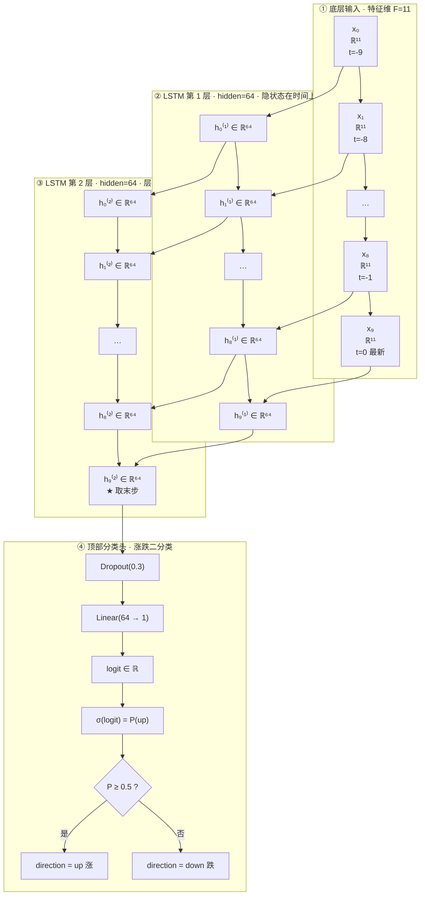

**如何读这张图：**

1. **横向（时间流向）**：`x₀ → … → x₉` 是长度为 **T=10** 的 bar 序列；同一层内箭头表示 LSTM 的 **h / c 跨时间步递推**。  
2. **纵向（底层→高层）**：每个时间步先喂 **11 维特征** → 第 1 层隐状态 → 第 2 层隐状态 →（仅末步）Dropout → Linear → **涨/跌**。  
3. **只取末步**：分类头只接 `h₉⁽²⁾`（最新 bar 对应的顶层隐状态），前面时间步的隐状态仅作记忆载体。

### 1.2 单时间步：一层 LSTM 单元内部

每个格子是一个 LSTM cell（输入门 / 遗忘门 / 输出门 + 细胞状态）：

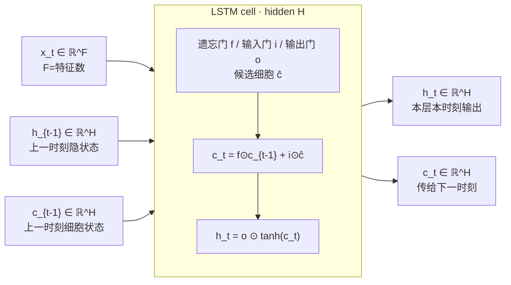

多层时：第 `ℓ` 层的输入不是原始 `x_t`，而是第 `ℓ-1` 层同一步的 `h_t^(ℓ-1)`（`batch_first=True` 时整段序列一次前向）。

### 1.3 隐含层如何表示（张量级）

以日模型为例，一次前向的张量变化：

```text
时间 →
          t=-9        t=-8        …        t=-1         t=0(最新)
        ┌────────┐  ┌────────┐         ┌────────┐  ┌────────┐
输入层  │ ℝ¹¹    │  │ ℝ¹¹    │   …     │ ℝ¹¹    │  │ ℝ¹¹    │   ← F=11 特征
        └───┬────┘  └───┬────┘         └───┬────┘  └───┬────┘
            │           │                  │           │
        ┌───▼────┐  ┌───▼────┐         ┌───▼────┐  ┌───▼────┐
LSTM L1 │ h⁽¹⁾64 │→ │ h⁽¹⁾64 │ → … →  │ h⁽¹⁾64 │→ │ h⁽¹⁾64 │   ← 隐含层① H=64
        └───┬────┘  └───┬────┘         └───┬────┘  └───┬────┘
            │           │                  │           │
        ┌───▼────┐  ┌───▼────┐         ┌───▼────┐  ┌───▼────┐
LSTM L2 │ h⁽²⁾64 │→ │ h⁽²⁾64 │ → … →  │ h⁽²⁾64 │→ │ h⁽²⁾64 │★  ← 隐含层② H=64
        └────────┘  └────────┘         └────────┘  └───┬────┘
                                                       │ 只取末步
                                                   Dropout
                                                       │
                                                 Linear(64→1)
                                                       │
                                                    logit
                                                       │
                                              sigmoid → P(up)
                                                       │
                                              ┌────────┴────────┐
                                              ▼                 ▼
                                         up（涨）          down（跌）
```

对应代码路径（[`lstm_model.py`](../backend/app/ml/lstm_model.py)）：

```text
x: (B, T, F)                    # T=序列长度, F=特征数
      │
      ▼
 nn.LSTM(..., batch_first=True)
      │  out: (B, T, H)         # 每个时间步的顶层隐状态
      │  (h_n, c_n) 丢弃         # h_n 形状 (num_layers, B, H)
      ▼
 out[:, -1, :]  → (B, H)        # ★ 末步 = 最新 bar 的序列摘要
      │
      ▼
 Dropout(p)
      │
      ▼
 Linear(H → 1) → squeeze → (B,) logit
      │
      ▼
 sigmoid → P(up) → {up, down}
```

| 符号 | 日 | 周 | 月 |
|------|----|----|----|
| 序列长度 **T** | 10 | 12 | 6 |
| 特征数 **F** | 11 | 11 | 11 |
| LSTM 层数 | 2 | 2 | 1 |
| 隐含宽度 **H** | 64 | 64 | 32 |
| 层间 dropout | 0.3（仅层数>1） | 0.3 | 无（单层） |
| 分类前 Dropout | 0.3 | 0.3 | 0.4 |
| 分类头 | Linear(H→1) | Linear(H→1) | Linear(H→1) |
| 输出类 | 涨 / 跌 | 涨 / 跌 | 涨 / 跌 |

---

## 2. 日度模型（day）

### 2.1 输入 / 输出语义

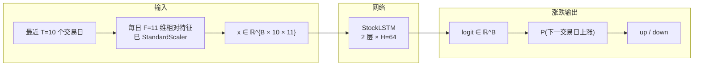

| | 说明 |
|--|------|
| **输入 bar** | 交易日 OHLCV（不聚合） |
| **特征数 F** | 11 维相对量（窗口以「日」计：1/5/14/20…） |
| **序列长度 T** | lookback = **10** 根日 K |
| **标签** | `close[t+1] > close[t]` → 1=涨, 0=跌 |
| **输出** | `P_day`、`direction∈{up,down}`；`as_of` = 最近交易日 |

### 2.2 网络拓扑（T=10 · F=11 · 2×64）

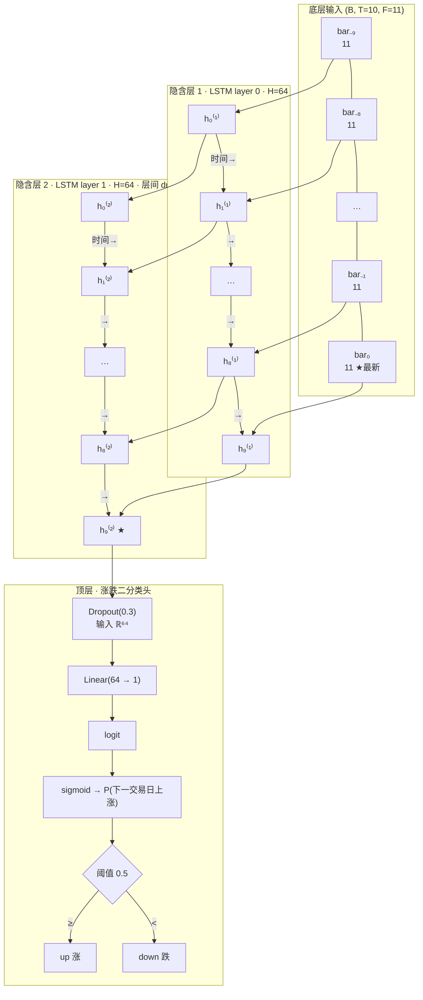

张量流（底→顶）：

```text
x: (B, 10, 11)          ← T=10 序列 × F=11 特征
      │  底层→高层
      ▼
 LSTM layer 0  (H=64)   → 中间态参与层间堆叠
 LSTM layer 1  (H=64)   → out: (B, 10, 64)
      │
      ▼
 out[:, -1, :] → (B, 64)   ← 时间轴末端（最新日）摘要
      │
      ▼
 Dropout(0.3) → Linear(64→1) → logit (B,)
      │
      ▼
 P(up) → direction ∈ {up, down}
```

---

## 3. 自然周模型（week）

### 3.1 输入 / 输出语义

周 K **不是**「往后数 5 个交易日」，而是把自然周内交易日聚合成一根：

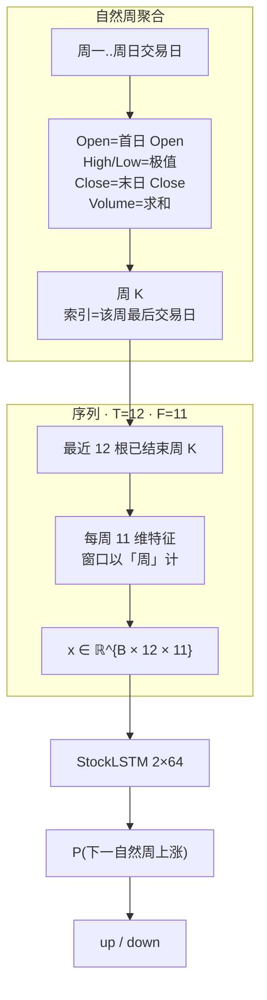

| | 说明 |
|--|------|
| **输入 bar** | 自然周 K（`W-SUN` 分组；未结束周丢弃） |
| **特征数 F** | 11（与日同构，滚动窗单位是 **周**） |
| **序列长度 T** | lookback = **12** 根周 K（约一个季度） |
| **标签** | 下一自然周收盘 > 本周收盘 → 涨/跌 |
| **输出** | `P_week`、`direction`；`as_of` = 最近已结束周的末日 |

### 3.2 网络拓扑（T=12 · F=11 · 2×64）

与日模型 **层结构同构**，仅序列更长（12 而非 10）：

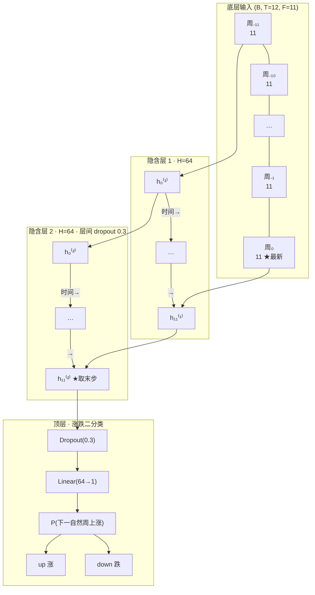

```text
x: (B, 12, 11)   ← T=12 周 × F=11 特征
      │ 底→顶
      ▼
 LSTM × 2, H=64  →  (B, 12, 64)
      │ 时间→ 取末周
      ▼
 (B, 64) → Dropout → Linear → logit → P_week → {up, down}
```

---

## 4. 自然月模型（month）

### 4.1 输入 / 输出语义

月样本少（行情源常仅约 2–3 年日线），因此 **更短 lookback + 更小网络 + 更短特征窗**。

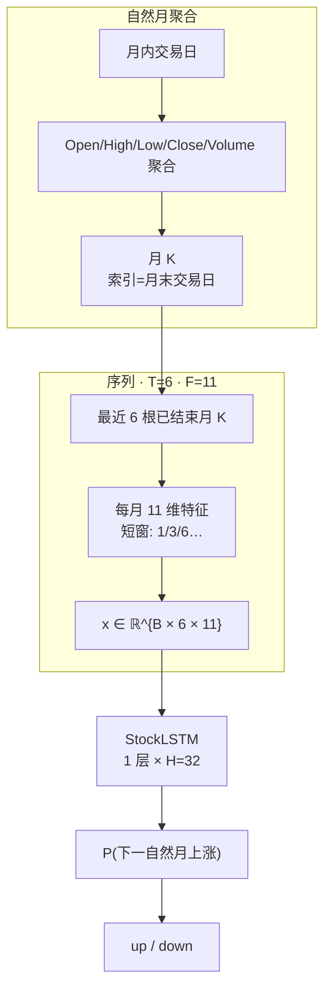

| | 说明 |
|--|------|
| **输入 bar** | 自然月 K（`period=M`；当月未结束则丢弃） |
| **特征数 F** | 仍 **11**，窗口缩短（RSI=6 月、SMA=3/6 月…） |
| **序列长度 T** | lookback = **6** 根月 K |
| **标签** | 下一自然月收盘 > 本月收盘 → 涨/跌 |
| **输出** | `P_month`、`direction`；`as_of` = 最近已结束月的末日 |
| **容量** | `H=32`, `num_layers=1`, `dropout=0.4`（防过拟合） |

### 4.2 网络拓扑（T=6 · F=11 · 1×32）

单层 LSTM：无「层间 dropout」，隐含层只有一层；时间仍从左到右，分类头仍在顶上。

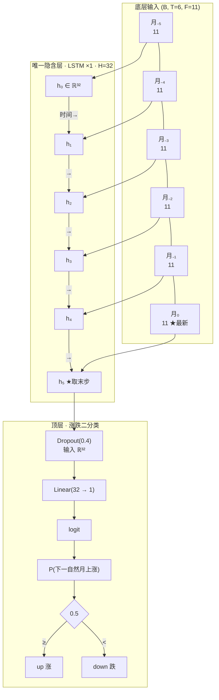

```text
x: (B, 6, 11)    ← T=6 月 × F=11 特征
      │ 底→顶（仅 1 个隐含层）
      ▼
 LSTM × 1, H=32  →  (B, 6, 32)
      │ 时间→ 取末月
      ▼
 (B, 32) → Dropout(0.4) → Linear(32→1) → logit → P_month → {up, down}
```

---

## 5. 三模型网络对照

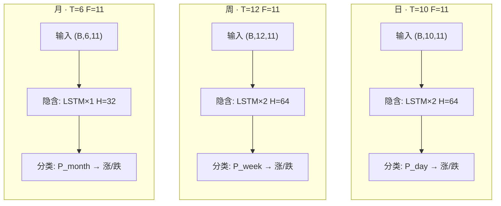

| 对比项 | 日 | 自然周 | 自然月 |
|--------|----|--------|--------|
| bar 来源 | 交易日 | 周内日线聚合 | 月内日线聚合 |
| 序列长度 **T** | 10 | 12 | 6 |
| 特征数 **F** | 11 | 11 | 11 |
| 输入形状 | `(B, 10, 11)` | `(B, 12, 11)` | `(B, 6, 11)` |
| 隐含层层数 | 2 | 2 | **1** |
| 隐含宽度 **H** | 64 | 64 | **32** |
| 层间 dropout | 0.3 | 0.3 | 无 |
| 分类前 dropout | 0.3 | 0.3 | **0.4** |
| 分类头 | Linear(64→1) | Linear(64→1) | Linear(32→1) |
| 预测对象 | 下一交易日涨/跌 | 下一自然周涨/跌 | 下一自然月涨/跌 |
| 产物目录 | `.../day/` | `.../week/` | `.../month/` |

**共享类，不共享权重：** 三者都实例化 [`StockLSTM`](../backend/app/ml/lstm_model.py)，但分别训练、分别落盘。

### 5.1 隐含层差异一眼看清

```text
日 / 周（深）                         月（浅）
────────────                         ────────
顶: Linear→涨跌                      顶: Linear→涨跌
    ↑                                    ↑
  Dropout                              Dropout(更强)
    ↑                                    ↑
 LSTM L2 (H=64)  ←── 多一层 ──┐         （无 L2）
    ↑                         │
 LSTM L1 (H=64)               │       LSTM L1 (H=32)  ←── 更窄
    ↑                         │            ↑
 x (T×11)  T=10 或 12         │       x (T×11)  T=6
```

---

## 6. 特征与标签（各尺度共用公式、不同时间单位）

11 维相对特征（无绝对价）即网络输入的 **F=11**：

`return_1`, `return_long`, `price_sma_fast_dev`, `price_sma_slow_dev`, `sma_fast_slope`, `sma_slow_slope`, `RSI`, `macd_hist_norm`, `bb_pct_b`, `vol`, `volume_sma_ratio`

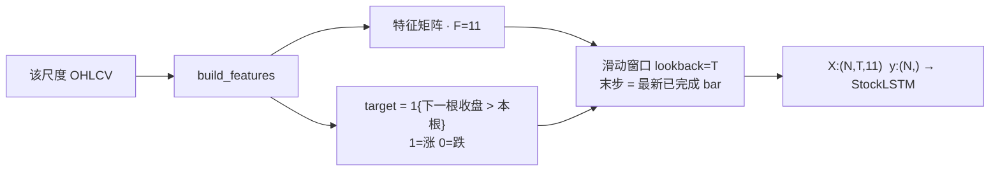

- 日/周特征窗：短/长收益 1&5，SMA 5&20，RSI 14，MACD 12/26/9，vol 20  
- 月特征窗：1&3，SMA 3/6，RSI 6，MACD 6/12/4，vol 6  

配置见 [`timeframes.py`](../backend/app/ml/timeframes.py)。

---

## 7. 聚合、产物与 API（摘要）

**周/月聚合**（[`resample.py`](../backend/app/ml/resample.py)）：Open=首日、High/Low=极值、Close=末日、Volume=求和；训练与推理均丢弃未结束周期。

**落盘：**

```text
models_store/{market}/{ticker}/
  day/{model.pt, scaler.joblib, meta.json}
  week/...
  month/...
```

**API：** `GET /api/predict/{ticker}` → `horizons[]`，每项含 `probability`、`direction`（`up`/`down`）、`as_of`、`architecture`、`training`、`series`。

**训练：** 一次任务顺序训 day→week→month；单尺度样本不足可失败，不拖垮其它尺度。损失为 `BCEWithLogitsLoss`（带 `pos_weight`）。

---

## 8. 限制

1. 月样本少，即使用小网络仍易过拟合或训不出。  
2. 腾讯日 K 参数过大返回空；`fetch_history` 会回退，实际历史常约 2–3 年。  
3. 验证集参与 early stopping，无独立 test。  
4. 仅供学习，不构成投资建议。
