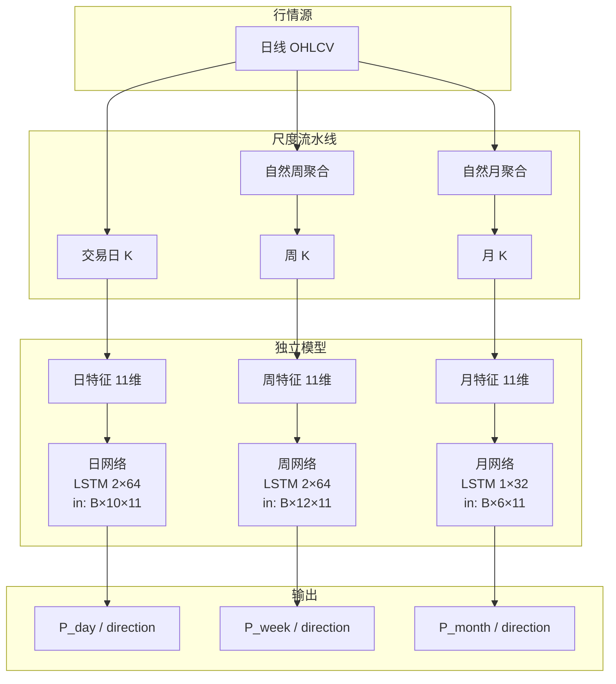
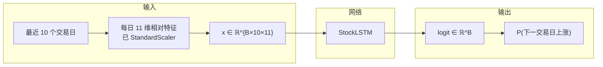
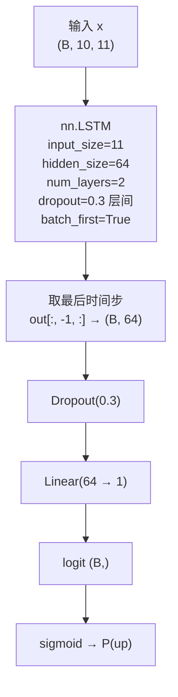
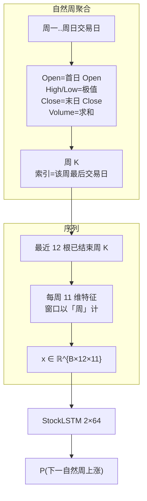
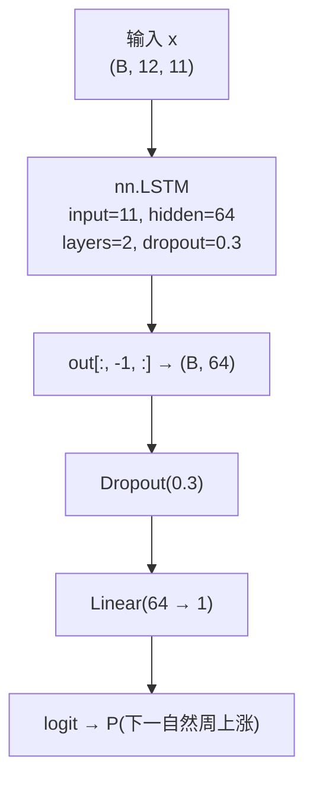
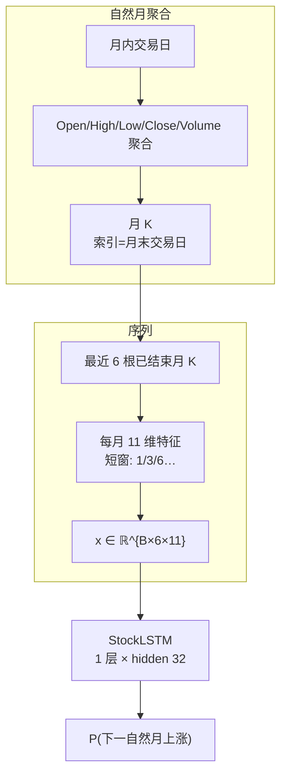
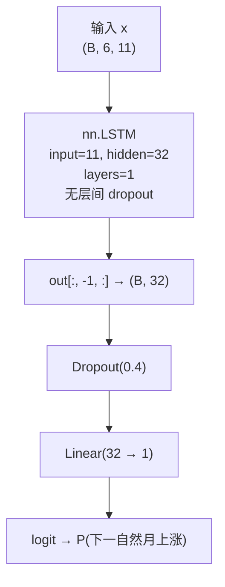
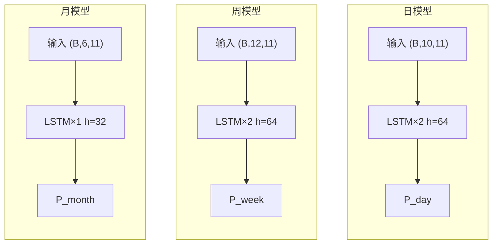
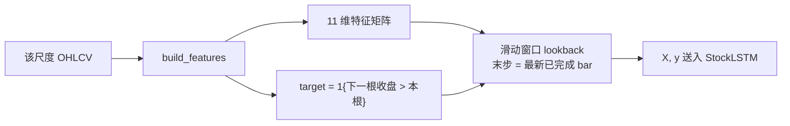

# 模型结构说明（日 / 自然周 / 自然月）

本文档用图文说明三套 **尺度对齐、彼此独立** 的涨跌二分类模型：各自的数据入口、张量输入、网络结构与输出语义。

| 项 | 值 |
|----|-----|
| 代码 | `backend/app/ml/` |
| 特征版本 | `v5-scale` |
| 任务 | 二分类：下一根同尺度 K 相对本根是否上涨 |
| 共性骨架 | `StockLSTM`：LSTM → 取末步 → Dropout → Linear(1) → logit |

> 旧版 `v4-clf`（日频三头）已废弃，需按本版重新训练。

---

## 0. 总览：三套模型互不共享权重



| 尺度 | 输入 bar | 输入张量 | 网络 | 输出 |
|------|----------|----------|------|------|
| **日** | 交易日 | `(B, 10, 11)` | LSTM×2, h=64, dropout=0.3 | 下一 **交易日** 上涨概率 |
| **周** | 自然周 | `(B, 12, 11)` | LSTM×2, h=64, dropout=0.3 | 下一 **自然周** 上涨概率 |
| **月** | 自然月 | `(B, 6, 11)` | LSTM×1, h=32, dropout=0.4 | 下一 **自然月** 上涨概率 |

共性输出后处理：

```text
logit  ──sigmoid──►  P(up) ∈ (0,1)
                      │
                      ├── ≥ 0.5 → direction = up
                      └── < 0.5 → direction = down
```

---

## 1. 日度模型（day）

### 1.1 输入 / 输出语义



| | 说明 |
|--|------|
| **输入 bar** | 交易日 OHLCV（不聚合） |
| **特征** | 11 维相对量（窗口以「日」计：1/5/14/20…） |
| **lookback** | 10 根日 K |
| **标签** | `close[t+1] > close[t]`（下一交易日） |
| **输出** | `P_day`、`direction`；`as_of` = 最近交易日 |

### 1.2 网络结构



张量流：

```text
x: (B, 10, 11)
      │
      ▼
 LSTM × 2 层, hidden=64
      │  out: (B, 10, 64)   （h_n, c_n 丢弃）
      ▼
 out[:, -1, :]     → (B, 64)    ← 最近一日的序列摘要
      │
      ▼
 Dropout(0.3)
      │
      ▼
 Linear(64 → 1) → squeeze → (B,) logit
      │
      ▼
 sigmoid(logit) = P(下一交易日上涨)
```

---

## 2. 自然周模型（week）

### 2.1 输入 / 输出语义

周 K **不是**「往后数 5 个交易日」，而是把自然周内交易日聚合成一根：



| | 说明 |
|--|------|
| **输入 bar** | 自然周 K（`W-SUN` 分组；未结束周丢弃） |
| **特征** | 与日模型同构的 11 维，但滚动窗单位是 **周** |
| **lookback** | 12 根周 K（约一个季度） |
| **标签** | 下一自然周收盘 > 本周收盘 |
| **输出** | `P_week`、`direction`；`as_of` = 最近已结束周的末日 |

### 2.2 网络结构

与日模型 **同构**（层数/宽度相同），仅序列长度不同：



```text
x: (B, 12, 11)  ← 12 周 × 11 特征
      │
      ▼
 LSTM × 2, h=64  →  (B, 12, 64)
      │
      ▼
 末周隐状态 (B, 64) → Dropout → Linear → logit → P_week
```

---

## 3. 自然月模型（month）

### 3.1 输入 / 输出语义

月样本少（行情源常仅约 2–3 年日线），因此 **更短 lookback + 更小网络 + 更短特征窗**。



| | 说明 |
|--|------|
| **输入 bar** | 自然月 K（`period=M`；当月未结束则丢弃） |
| **特征** | 仍 11 维，但窗口缩短（如 RSI=6 月、SMA=3/6 月） |
| **lookback** | 6 根月 K |
| **标签** | 下一自然月收盘 > 本月收盘 |
| **输出** | `P_month`、`direction`；`as_of` = 最近已结束月的末日 |
| **容量** | `hidden=32`, `num_layers=1`, `dropout=0.4`（防过拟合） |

### 3.2 网络结构



```text
x: (B, 6, 11)   ← 6 月 × 11 特征
      │
      ▼
 LSTM × 1, h=32  →  (B, 6, 32)
      │
      ▼
 末月隐状态 (B, 32) → Dropout(0.4) → Linear(32→1) → logit → P_month
```

---

## 4. 三模型对照（一张图）



| 对比项 | 日 | 自然周 | 自然月 |
|--------|----|--------|--------|
| bar 来源 | 交易日 | 周内日线聚合 | 月内日线聚合 |
| 输入形状 | `(B, 10, 11)` | `(B, 12, 11)` | `(B, 6, 11)` |
| LSTM 层数 | 2 | 2 | **1** |
| hidden | 64 | 64 | **32** |
| dropout | 0.3 | 0.3 | **0.4** |
| 预测对象 | 下一交易日涨跌 | 下一自然周涨跌 | 下一自然月涨跌 |
| 产物目录 | `.../day/` | `.../week/` | `.../month/` |

**共享类，不共享权重：** 三者都实例化 [`StockLSTM`](../backend/app/ml/lstm_model.py)，但分别训练、分别落盘。

---

## 5. 特征与标签（各尺度共用公式、不同时间单位）

11 维相对特征（无绝对价）：

`return_1`, `return_long`, `price_sma_fast_dev`, `price_sma_slow_dev`, `sma_fast_slope`, `sma_slow_slope`, `RSI`, `macd_hist_norm`, `bb_pct_b`, `vol`, `volume_sma_ratio`



- 日/周特征窗：短/长收益 1&5，SMA 5&20，RSI 14，MACD 12/26/9，vol 20  
- 月特征窗：1&3，SMA 3&6，RSI 6，MACD 6/12/4，vol 6  

配置见 [`timeframes.py`](../backend/app/ml/timeframes.py)。

---

## 6. 聚合、产物与 API（摘要）

**周/月聚合**（[`resample.py`](../backend/app/ml/resample.py)）：Open=首日、High/Low=极值、Close=末日、Volume=求和；训练与推理均丢弃未结束周期。

**落盘：**

```text
models_store/{market}/{ticker}/
  day/{model.pt, scaler.joblib, meta.json}
  week/...
  month/...
```

**API：** `GET /api/predict/{ticker}` → `horizons[]`，每项含 `probability`、`direction`、`as_of`、`architecture`、`training`、`series`。

**训练：** 一次任务顺序训 day→week→month；单尺度样本不足可失败，不拖垮其它尺度。

---

## 7. 限制

1. 月样本少，即使用小网络仍易过拟合或训不出。  
2. 腾讯日 K 参数过大返回空；`fetch_history` 会回退，实际历史常约 2–3 年。  
3. 验证集参与 early stopping，无独立 test。  
4. 仅供学习，不构成投资建议。
